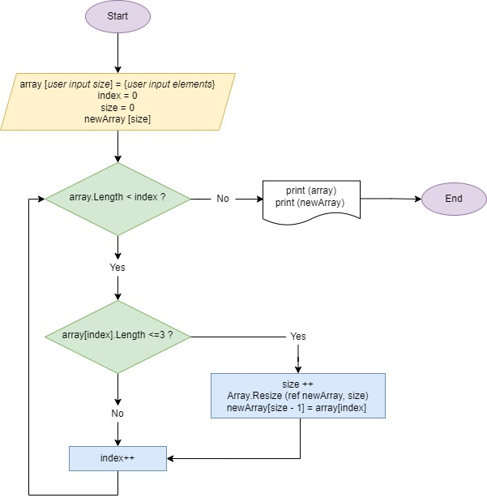

# Three in a boat program
*Примечание автора: программа носит название "Трое в лодке", т.к. "собака", согласно условию, к сожалению, в массив не помещается.* 😃   

## Описание 
Приветсвуем и спасибо, что выбрали наш продукт! Данная программа позволяет из заданного массива сформировать новый массив с тем условием, что длина каждого из элементов нового массива меньше либо равна 3 (трем) символам. Первоначальный массив задаётся пользователем (см. раздел "Входные данные"). Программа использует различные методы для реалиации поставленной задачи (см. раздел "Используемые методы"). 

## Входные данные
При запуске программа сделает запрос пользователю на длину и наполнение первоначального (заданного) массива. В зависимости от размерности массива, который введёт пользователь, программа запросит заполнить его таким же количеством элементов массива.
Пользователь может увидеть следующие запросы: 

**Please enter desired array length** - запрос пользователю на введение длины массива. 

**Please enter array element N** - запрос пользователю на введение значения N-ого элемента массива. 

## Используемые методы
В программе реализованы и использованы следующие методы:

1.  FillArray – метод на заполнение первоначального (заданного) массива. Метод включает запрос пользователю на ввод значения элементов массива. 
2.  ShowArray – метод для вывода на экран первоначального (заданного) массива. Выводит сообщение "You have created the following array:" и непосредственно сам массив. 
3.  ResultArray – метод на формирование нового массива с заданным условием *(длина каждого из элементов нового массива должна быть меньше либо равна 3 (трем) символам)*.
4.  ShowResultArray - метод для вывода на экран нового массива. Выводит сообщение "The result array with elements shorter or equal to 3 symbols is:" и непосредственно сам массив.

## Алгоритм
Для целей реализации программы использовался следующий алгоритм (в блок-схеме описана содержательная часть основного метода):

## Алгоритм
Репозиторий с программой и необходимыми файлами можно найти по следующей ссылке: 
https://github.com/Dzirttos/First-Term-Final-Project.git
